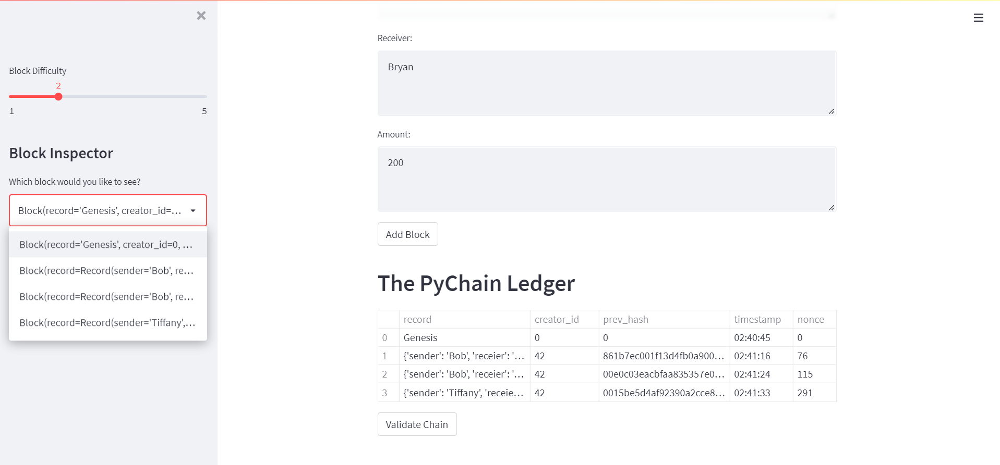
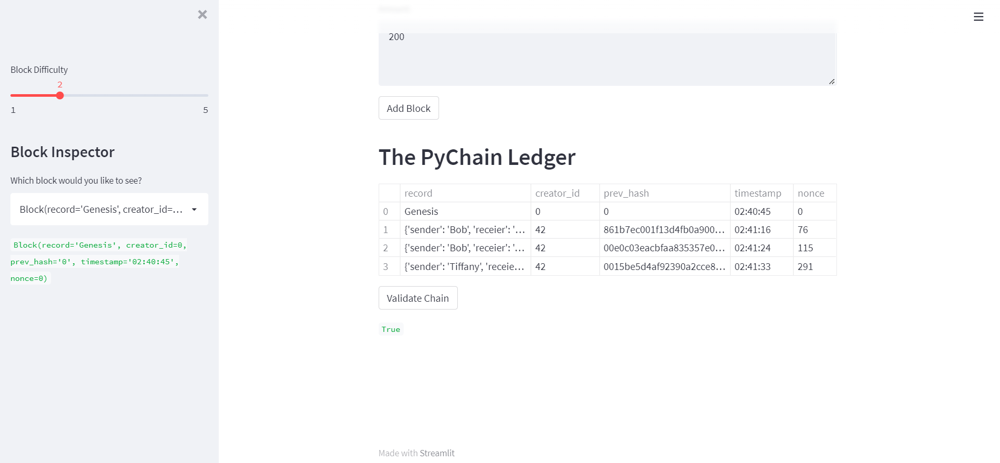

# Blockchain With Python

This python script consist of a basic implementation of the blockchain using Python. Streamlit was used in order to create a simple web application for ease of use. The following screenshots show some example usage of the web page:

<br>

# Implementation:
To simulate a simple blockchain, the following classes were implemented:

* Record: a class used to record transactions.
* Block: the block of the blockchain, will hold the verified records (transactions).
* Pychain: the chain of the blockchain, will link new verified hashed blocks to the new hashed block.
* Streamlit: the library used to create a simple web application to visual the simple blockchain.


<br>

# Screenshot:

Blockchain Implementation Usage:


<br>

Blockchain Validation:


<br>

# Technologies:

The following libraries were used to make this blockchain:
```
Dataclasses
Hashlib
Streamlit
Pandas
```